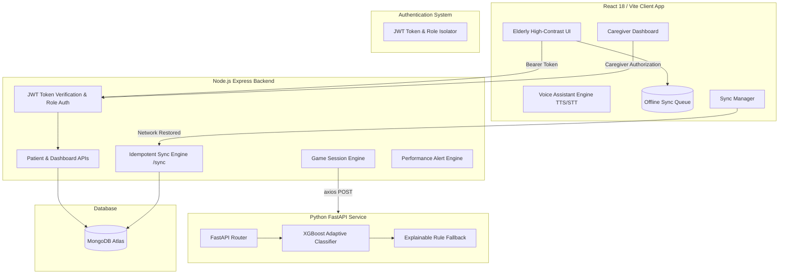

# MINDMATE NER

## AI-Powered Cognitive Companion for Elderly Dementia Care (North Eastern Region of India)

> **Tagline**: *"An AI-powered cognitive companion that adapts to every elderly user, works offline, supports voice and regional languages, and keeps caregivers connected."*

---

## 🌐 Live Production Deployments

| Component | Platform | Live URL | Status |
| :--- | :--- | :--- | :---: |
| **Mobile Frontend** | **Vercel** | [https://sih-26003-hazel.vercel.app/](https://sih-26003-hazel.vercel.app/) | 🟢 **Live** |
| **Backend REST API** | **Render** | [https://mindmate-backend-dopt.onrender.com/](https://mindmate-backend-dopt.onrender.com/) | 🟢 **Live** |
| **Backend Health Check** | **Render** | [https://mindmate-backend-dopt.onrender.com/health](https://mindmate-backend-dopt.onrender.com/health) | 🟢 **Live** |
| **GitHub Repository** | **GitHub** | [https://github.com/Gayathritata/SIH26003](https://github.com/Gayathritata/SIH26003) | 🟢 **Main** |

---

> [!IMPORTANT]
> **Medical Disclaimer**: MINDMATE NER is a supportive cognitive assistance and engagement prototype designed for caregivers and elderly users. It is **NOT** a medical diagnostic tool and does **NOT** diagnose dementia, Alzheimer's disease, or any neurological disorder. All metrics are presented strictly as **Cognitive Performance Indicators** and activity trends.

---

## 1. Problem Statement & Core Innovation

### Problem Statement
The North Eastern Region (NER) of India faces distinct healthcare accessibility challenges in remote and rural areas. Elderly individuals experiencing age-related cognitive decline or memory loss often lack continuous access to specialized neurological care, structured cognitive exercises, and real-time caregiver monitoring.

### Core Innovation: Adaptive Cognitive Engine
Unlike static memory game apps, MINDMATE NER features an **AI-driven Adaptive Cognitive Engine**. Powered by a trained **XGBoost Classifier** model, the engine dynamically analyzes session performance metrics (accuracy, reaction time, mistake count, previous level, mood) to recommend an optimized difficulty level for the next session along with **Explainable AI (XAI)** rationale.

---

## 2. Technology Stack

| Layer | Technologies |
| :--- | :--- |
| **Frontend Client** | React 18, Vite, TypeScript, Lucide Icons, Web Speech API (TTS/STT), High-Contrast Glassmorphic Elderly UI System |
| **Authentication** | JWT Authentication, HTTP-Only Cookies, Local User Cache Sync, Role Isolation (`caregiver`, `elderly_user`, `admin`) |
| **Backend API** | Node.js, Express, TypeScript, Mongoose ODM, CORS Authorization |
| **Database** | MongoDB (`users`, `patientProfiles`, `caregiverPatients`, `gameSessions`, `gameContent`, `reminders`, `moodLogs`, `alerts`) |
| **AI / ML Service** | Python, FastAPI, XGBoost, Scikit-learn, Pandas, NumPy, Joblib |
| **Offline Engine** | Local Storage Queue with Idempotent `/sync` payload processing |
| **Localization** | Multilingual Translation Engine: English (`en`), Hindi (`hi`), Assamese (`as`) |

---

## 3. System Architecture



---

## 4. Monorepo Directory Structure

```
SIH_003/
├── client/                   # Vite React Frontend Application
│   ├── src/
│   │   ├── components/       # Memory Match, Pattern, Routine & Object Rec Games, Dashboard
│   │   ├── services/         # Auth Service, API Client, Voice Service, Offline Queue
│   │   ├── i18n/             # English, Hindi, Assamese Translation Dictionaries
│   │   ├── App.tsx           # Main Application Shell & Role-Based Navigation Router
│   │   └── index.css         # High-Contrast Elderly Design System
│   ├── package.json
│   ├── vercel.json           # Vercel Deployment Configuration
│   └── vite.config.ts
│
├── backend/                  # Node.js Express Backend API
│   ├── src/
│   │   ├── config/           # Database Setup & Connection Management
│   │   ├── models/           # Mongoose Data Schemas (User, PatientProfile, GameSession, etc.)
│   │   ├── middleware/       # JWT Auth & Role Authorization Middleware
│   │   ├── controllers/      # Auth, Patient, Game, Reminder, Mood, Sync, Dashboard Controllers
│   │   ├── services/         # ML Client, Analytics Calculator, Alert Engine
│   │   ├── utils/            # Seed script for demo accounts & cultural content
│   │   ├── app.ts
│   │   └── server.ts
│   ├── package.json
│   └── tsconfig.json
│
├── ml-service/               # Python FastAPI AI/ML Engine
│   ├── app/
│   │   ├── main.py           # FastAPI Endpoints
│   │   ├── services.py       # ML Model Container & Analytics Engine
│   │   ├── fallback.py       # Deterministic Rule Fallback & Explainable AI
│   │   └── schemas.py        # Pydantic Schemas
│   ├── scripts/
│   │   ├── generate_dataset.py # Synthetic 5,500 record dataset generator
│   │   └── train_model.py    # XGBoost vs Random Forest Training Script
│   ├── models/               # Exported adaptive_model.pkl binary
│   └── requirements.txt
│
├── package.json              # Monorepo Root Script Configuration
├── vercel.json               # Root Vercel Monorepo Deployment Setup
├── render.yaml               # Render Service Blueprint
└── README.md
```

---

## 5. Account Registration & Role Routing

MINDMATE NER enforces **Strict Role Isolation**:

- **Caregiver Registration (`caregiver`)**:
  - Automatically routed to the **Caregiver Dashboard** (`caregiver_home`).
  - Access to patient analytics, cognitive score indicators, alerts, and management views.
- **Elderly User Registration (`elderly_user`)**:
  - Automatically routed to the **Elderly Companion Home Screen** (`elderly_home`).
  - Access to cognitive games, medication/hydration reminders, mood check-in, and voice assistant.
- **Sign-In Persistence**:
  - Accounts created during registration are immediately stored in MongoDB and synchronized with the local fallback store. Any registered user can sign in through the Sign-In page with their exact credentials.

---

## 6. ML Model Metrics & Performance

- **Dataset**: 5,500 synthetic session records (`synthetic_cognitive_dataset.csv`).
- **Model Comparison**:
  - **Random Forest**: Accuracy `93.55%` | F1 Macro `0.9358`
  - **XGBoost Classifier (Winner)**: Accuracy `93.91%` | F1 Macro `0.9392`
- **Model Binary**: Exported to `ml-service/models/adaptive_model.pkl`.

---

## 7. Local Quick Start Commands

### Root Monorepo Build
```bash
npm install
npm run build
```

### 1. Start Node.js Express Backend (Port 5000)
```bash
cd backend
npm install
npm run seed   # Seeds demo accounts & NE India cultural game content
npm run dev
```

### 2. Start Client Frontend Application (Port 5173)
```bash
cd client
npm install
npm run dev
```

### 3. Start Python FastAPI ML Service (Port 8000)
```bash
cd ml-service
python -m pip install -r requirements.txt
python scripts/generate_dataset.py
python scripts/train_model.py
python -m uvicorn app.main:app --host 0.0.0.0 --port 8000
```

---

## 8. 5-Minute Hackathon Demo Script

1. **0:00 - 0:30 (Introduction & Problem Statement)**:
   - Introduce MINDMATE NER as an offline-capable, AI-powered cognitive companion built specifically for elderly users in North Eastern India.

2. **0:30 - 1:15 (Elderly Experience & Multilingual Voice)**:
   - Open app at [https://sih-26003-hazel.vercel.app/](https://sih-26003-hazel.vercel.app/). Switch language to Assamese (`AS`) or Hindi (`HI`).
   - Hear voice greeting: *"Good Morning Asha Devi"*. Select mood check-in (😊 *Happy*).

3. **1:15 - 2:00 (Interactive Cognitive Games & AI Adaptation)**:
   - Click **Memory Match** or **Object Recognition** (featuring Jhapi, Eri Silk, Kaziranga Rhino).
   - Complete session with 95% accuracy and fast reaction time.
   - View **Game Result Modal**: Displays accuracy (95%), reaction time (2.8s), **AI Recommended Level 4**, and Explainable AI rationale: *"Level raised from 3 to 4 for cognitive stimulation."*

4. **2:00 - 2:40 (Offline Capability & Synchronization)**:
   - Toggle **"Offline Mode"**. Play activity offline -> *"Progress saved locally in offline mode."*
   - Click **"Go Online"** -> Click **"Sync Now"** -> Receive notification: *"3 records synchronized successfully."*

5. **2:40 - 4:10 (Caregiver Dashboard & Alerts)**:
   - Log in as Caregiver -> Open **Caregiver Dashboard** -> Inspect assigned patient *"Asha Devi"* (74 yrs).
   - View real-time **Cognitive Performance Indicators** (Memory: 85%, Attention: 90%, Overall Index: 82%).
   - Review actionable **Performance Change Alert** banner.

6. **4:10 - 5:00 (Conclusion)**:
   - Highlight offline resilience, regional cultural accessibility, non-diagnostic caregiver alerts, and end-to-end hackathon implementation.

---

## 9. Quality Audit Checklist

| Feature / Requirement | Status | Module / Location |
| :--- | :---: | :--- |
| **Adaptive Cognitive Engine** | ✅ Working | `ml-service/app/services.py`, XGBoost classifier |
| **Memory Match Game** | ✅ Working | `client/src/components/games/MemoryMatchGame.tsx` |
| **Pattern Recognition Game** | ✅ Working | `client/src/components/games/PatternRecognitionGame.tsx` |
| **Daily Routine Recall Game** | ✅ Working | `client/src/components/games/RoutineRecallGame.tsx` |
| **Object Recognition Game** | ✅ Working | `client/src/components/games/ObjectRecognitionGame.tsx` |
| **NE India Cultural Content** | ✅ Working | `backend/src/utils/seed.ts` (Jhapi, Eri Silk, Rhino, Loktak Lake) |
| **Multilingual (EN, HI, AS)** | ✅ Working | `client/src/i18n/translations.ts` |
| **Voice Assistant System** | ✅ Working | `client/src/services/voiceService.ts` (Web Speech TTS/STT) |
| **Offline-First Sync Queue** | ✅ Working | `client/src/services/offlineService.ts` |
| **Idempotent Sync Engine** | ✅ Working | `backend/src/controllers/syncController.ts` (`/sync`) |
| **Reminders System** | ✅ Working | `backend/src/controllers/reminderController.ts` |
| **Mood & Engagement Logger** | ✅ Working | `backend/src/controllers/moodController.ts` |
| **Caregiver Dashboard** | ✅ Working | `client/src/components/CaregiverDashboard.tsx` |
| **Cognitive Indicators (Non-Diagnostic)** | ✅ Working | `backend/src/services/analyticsService.ts` |
| **JWT Auth & Role Isolation** | ✅ Working | `backend/src/middleware/authMiddleware.ts` |
| **Elderly High-Contrast UI/UX** | ✅ Working | `client/src/index.css` (20pt+ fonts, 60px+ touch targets) |
